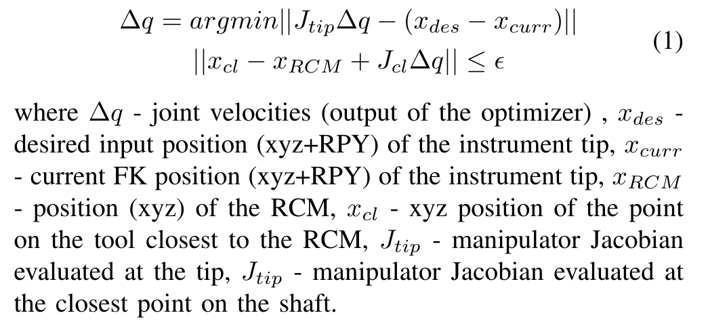

# RSP Final project
It implements RCM of UR5 robot based on constrained optimization approach.

### Members: Yernar Zhetpissov (JHED id: yzhetpi1)




### Installation instructions:
Dependencies:
* pyOpt [http://www.pyopt.org/install.html]. If having numpy compatibility error "TypeError: only integer scalar arrays can be converted to a scalar index"m replace lz with lz[0] `/usr/local/lib/python2.7/dist-packages/pyOpt/pySLSQP/pySLSQP.py` in
Lines
```
374     gg = numpy.zeros([la[0]], numpy.float)
377     dg = numpy.zeros([la[0],n+1], numpy.float)
401     w = numpy.zeros([lw[0]], numpy.float)
404     jw = numpy.zeros([ljw[0]], numpy.intc)
```
)

* gfortran (or other fotran compiler)
`sudo apt-get install gfortran`

* packages used in the course assignments (fmauch_universal_robot, Universal_Robots_ROS_Driver, Universal_Robots_Client_Library, ocoros, ros_control, rtt_ros_integration, kdl_typekit) 

### Simulation running instruction:
```
catkin build tool_description ur5_tool_description ur5_rcm_msgs ur5_tool_gazebo ur5_rcm_srvcli
source devel/setup.bash
roslaunch ur5_rcm_srvcli ur5_rcm.launch
```
It will launch deployer, Gazebo window with the robot, Rviz and dynamic reconfigure (for changing 'xyz_des' and 'xyz_RCM' poses). It should directly go to the defined default desired tool position respecting defined RCM.


### List of packages (ALL LOCATED AT "src/rcm" FOLDER):
* tool_description - xacro description of the tool
* ur5_tool_description - xacro file merging UR5 official description with the tool description
* ur5_rcm_msgs - service message for RCM calculations 
  * Inputs:
    * 1) 6x1 array of xyz_tip and xyz_cl (closest to RCM point on the shaft)
    * 2) Flattened array (3x6 => 18x1) of the Manipulator Jacobian evaluated at the tool tip "xyz_tip or x_curr"
    * 3) Flattened array (3x6 => 18x1) of the Manipulator Jacobian evaluated at "xyz_cl" the point on the shaft closest to the RCM 
  * Outputs: 
    * 1) 6x1 array of joint velocity commands
*  ur5_tool_gazebo - package for gazebo configuration of the UR5 + tool
*  ur5_rcm_srvcli - MAIN package which implements RCM optimization server, RTT deployer logic, constructs KDL chain from robot_description, controller config files

### Deliverables
There is no demo video with real UR5 yet, but here there is demo of the simulation:
[](https://www.youtube.com/watch?v=n_97qhFkzqA)

There is also a video of the simulation in AMBF environment with same RCM logic with active tool:
[](https://www.youtube.com/watch?v=sJOVtvhsAN0)
